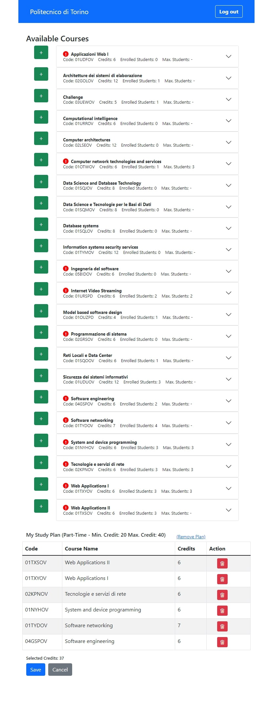

# Project Name: "StudyPlan"
## Developed by: ZAKHIREH Milad 

## React Client Application Routes

- Route `/`: course list to be displayed for unauthenticated (anonymous) users
- Route `login`: login form to be displayed for user authorization
- Route `my-portal`: user's personal portal where they can create/modify their study plan; course list is also available for the users who are logged in


## API Server

- POST `/api/plans`
- 
  - request parameters:
  - request body content:
  ```
  {
    mincredit: 40,
    maxcredit: 60,
    type: 'Full-Time',
    userid: 4
  }
  ```
  - response body content: _NONE_

- POST `/api/courses`
- 
  - request parameters: _NONE_
  - request body content:
```
{
  courses: [
    {
      code: '01TYDOV',
      courseName: 'Software networking',
      credits: 7,
      maxStudents: 0,
      incomps: [],
      preps: []
    },
    {
      code: '01NYHOV',
      courseName: 'System and device programming',
      credits: 6,
      maxStudents: 3,
      incomps: [Array],
      preps: []
    },
    {
      code: '03UEWOV',
      courseName: 'Challenge',
      credits: 5,
      maxStudents: 0,
      incomps: [],
      preps: []
    },
    {
      code: '01OTWOV',
      courseName: 'Computer network technologies and services',
      credits: 6,
      maxStudents: 3,
      incomps: [Array],
      preps: []
    },
    {
      code: '01URSPD',
      courseName: 'Internet Video Streaming',
      credits: 6,
      maxStudents: 2,
      incomps: [],
      preps: []
    },
    {
      code: '02GOLOV',
      courseName: 'Architetture dei sistemi di elaborazione',
      credits: 12,
      maxStudents: 0,
      incomps: [Array],
      preps: []
    },
    {
      code: '01UDUOV',
      courseName: 'Sicurezza dei sistemi informativi',
      credits: 12,
      maxStudents: 0,
      incomps: [Array],
      preps: []
    },
    {
      code: '05BIDOV',
      courseName: 'Ingegneria del software',
      credits: 6,
      maxStudents: 0,
      incomps: [Array],
      preps: [Array]
    }
  ]
}
```
  - response body content: _NONE_

- GET `/api/sessions/current`
  - request parameters: _NONE_
  - response body content:
```
{
  "user":
  {
    "id":2,
    "username":"joeyscientist@polito.com",
    "name":"Joey"
  }
}
```

- GET `/api/courses`
  - request parameters: _NONE_
  - response body content:
  ```
  [
    {
      code: '02GOLOV',
      name: 'Architetture dei sistemi di elaborazione',
      credit: 12,
      maxstudent: 0,
      incompatible: [ '02LSEOV' ],        
      prepcourse: [],
      enroll: 1
    },
    {
      code: '02LSEOV',
      name: 'Computer architectures ',   
      credit: 12,
      maxstudent: 0,
      incompatible: [ '02GOLOV' ],        
      prepcourse: [],
      enroll: 0
    },
    {
      code: '01SQJOV',
      name: 'Data Science and Database Technology',
      credit: 8,
      maxstudent: 0,
      incompatible: [ '01SQMOV', '01SQLOV' ],
      prepcourse: [],
      enroll: 0
    },
    {
      code: '01SQMOV',
      name: 'Data Science e Tecnologie per le Basi di Dati',
      credit: 8,
      maxstudent: 0,
      incompatible: [ '01SQJOV', '01SQLOV' ],
      prepcourse: [],
      enroll: 0
    },
    {
      code: '01SQLOV',
      name: 'Database systems ',
      credit: 8,
      maxstudent: 0,
      incompatible: [ '01SQJOV', '01SQMOV' ],
      prepcourse: [],
      enroll: 0
    }
    .
    .
    .
  ]
  ```

- DELETE `/api/plandata/:id`
  - request parameters: 5
  - response body content: _NONE_


## Database Tables

- Table `user` - contains id, email, password, salt and name
- Table `course` - contains code, name, credit, maxstudent, incompatible, prepcourse
- Table `plan` - contains id, minCredit, maxCredit, type and userID
- Table `enregistry` - contains id, courseCode and planID


## Main React Components

- `CusContent` (in `Components/MainPage.js`): This component holds the main parts of the application, which are customized with respect to the route, together in itself.
- `LoginForm` (in `Components/loginForm.js`): Contains a from through which users can log into their university portal.
- `CusNavBar` (in `Components/CusNavBar.js`): This component is placed at the top of all pages and is mainly composed of login/logout buttons and a title one of which may be replaced with the other under certain circumstances.
- `Program` (in `Components/StudyPlan/Program.js`): component purpose and main functionality
- `Plan` (in `Components/StudyPlan/Plan.js`): component purpose and main functionality
- `CourseList` (in `Components/Courses/CourseList.js`): component purpose and main functionality

(only _main_ components, minor ones may be skipped)


## Screenshot




## Users Credentials

- miladml@polito.com, 123456 
- joeyscientist@polito.com, 1234567 
- test1@polito.com, test11 
- test2@polito.com, test22 
- test3@polito.com, test33 
